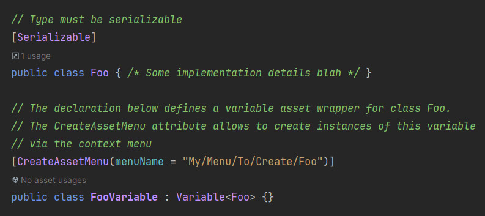

# Asset Variables

Unity Library for creating variables (e.g. of type **int**, **float**, etc) as scriptable object assets in the editor.
This can help decouple your code base by making shared data easily available across the project.

The library is based on the following presentation:

[Unite Austin 2017 - Game Architecture with Scriptable Objects](https://www.youtube.com/watch?v=raQ3iHhE_Kk)


## How to install

### Using the package manager
+ For this approach, [git](https://git-scm.com/book/en/v2/Getting-Started-Installing-Git) 
must be installed on your machine.
+ In the Unity Editor, open the package manager via 
**Window &rarr; Package Manager**.
+ Press the plus sign in the top left and select 
**Add Package from git URL**:
<p align="center">
    
</p>

+ Paste in the following URL: 
https://github.com/Lovely-Bytes-Gaming/asset-variables.git?path=Assets/AssetVariables#v1.0.0
+ The package manager should now start installing the package


### Or: Copy Paste
+ Download the [zip file](https://github.com/Lovely-Bytes-Gaming/asset-variables/archive/refs/tags/v1.0.0.zip)
+ Unpack it and find the folder **AssetVariables** under **Assets**
+ Drag and drop the folder **AssetVariables** anywhere into your project, e.g. under **Assets/Plugins**

## Content

### 1.Variables

Each Variable has a *Value* property for reading/writing and an *OnValueChanged* callback, 
providing the old and new value,
that can be listened to via script:
```csharp
_exampleIntVariable.OnValueChanged += SomeCallback;
```
In playmode, listeners are also notified when the value is changed 
in the inspector.

Variable Assets for most built-in types are already predefined.
They can be created by right-clicking into your
content-browser and selecting the desired type under **Create &rarr; LovelyBytes &rarr; AssetVariables**:
<p align="center">
    
</p>

Under the same path, there is also an option to create the C# code for new **Enums** and **Structs** along with their
corresponding Variable Wrapper.
<p align="center">
    
</p>

Finally, Variable wrappers for any type can be created via inheritance:


### 2. Observables
Lightweight, C# only version of variables. 
You can think of it as a variable that is "embedded" into the class
it is declared in.

Declaration example:
```csharp
[SerializeField]
private Observable<float> _someFloat = new(1f);
```
Just as variables, comes with a *Value* property and an *OnValueChanged* event.

### 3. GetSetAttribute
Custom Attribute for fields that have a corresponding 
getter/setter property. Causes the setter to be called when the value of the
serialized field changes in the inspector (**Only during playmode**).

For example, the code below will lead to "Value Changed" being logged whenever 
the user changes the value of *_foo* in the inspector:
```csharp
[SerializeField, GetSet(nameof(Foo))]
private int _foo;

public int Foo 
{
    get => _foo;
    set => 
    {
        Debug.Log("Value Changed!");
        _foo = value;
    }
```

### 4. Runtime Listeners
--- TODO ---

### 5. List Objects
--- TODO ---


