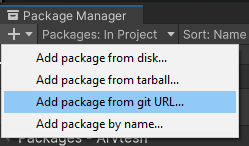
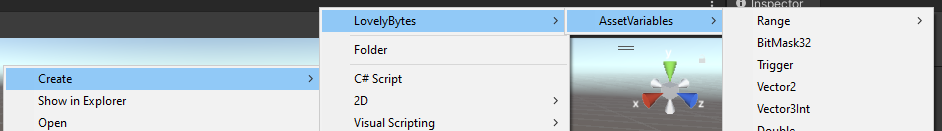
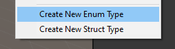

# Asset Variables

Unity Library for creating variables (e.g. of type **int**, **float**, etc) as scriptable object assets in the editor.
This can help decouple your code base by making shared data easily available across the project.

The library is based on the following presentation:

[Unite Austin 2017 - Game Architecture with Scriptable Objects](https://www.youtube.com/watch?v=raQ3iHhE_Kk)

Tested with the following Unity Versions 
+ Unity 2021.3.31f3
+ Unity 2022.3.10f3

## How to install

### Using the package manager
+ For this approach, [git](https://git-scm.com/book/en/v2/Getting-Started-Installing-Git) 
must be installed on your machine.
+ In the Unity Editor, open the package manager via 
**Window &rarr; Package Manager**.
+ Press the plus sign in the top left and select 
**Add Package from git URL**:
<p align="center">
    
</p>

+ Paste in the following URL: 
https://github.com/Lovely-Bytes-Gaming/asset-variables.git?path=Assets/AssetVariables#v1.0.0
+ The package manager should now start installing the package


### As an embedded package
+ Download the [zip file](https://github.com/Lovely-Bytes-Gaming/asset-variables/archive/refs/tags/v1.0.0.zip)
+ Unpack it and find the folder **AssetVariables** under **Assets**
+ Drag and drop the folder **AssetVariables** directly into your **Packages** folder
  (located in the same directory as your **Assets** folder)

## Content

### 1.Variables

Asset Variables are Scriptable Objects that implement the following interface:
```csharp
public interface IReadWriteView<TType>
{
    TType Value { get; set; }
    // param0: old value, param1: new value
    event System.Action<TType, TType> OnValueChanged;
    void SetWithoutNotify(TType newValue);
}
```

Each Variable has a *Value* property for reading/writing and an *OnValueChanged* callback, 
providing the old and new value,
that can be listened to via script:
```csharp
_exampleIntVariable.OnValueChanged += SomeCallback;
```
In playmode, listeners are notified even when the value is changed 
via the inspector.

Variable Assets for most built-in types are already predefined.
They can be created by right-clicking into your
content-browser and selecting the desired type under **Create &rarr; LovelyBytes &rarr; AssetVariables**:
<p align="center">
    
</p>

Under the same path, there is also an option to create the C# code for new **Enums** and **Structs** along with their
corresponding Variable Wrapper.
<p align="center">
    
</p>

Finally, Variable wrappers for any type can be created via inheritance:
```csharp
// Type must be serializable
[System.Serializable]
public class Foo {"Implementation details and so forth ..."}

// The declaration below defines a variable asset wrapper for class Foo.
// The CreateAssetMenu attribute allows to create instances of this variable
// via the context menu
[CreateAssetMenu(menuName = "My/Menu/To/Create/Foo")]
public class FooVariable : Variable<Foo> {}
```

### 2. Observables
Lightweight, C# only version of asset variables.
You can think of it as a variable that is "embedded" into the class
it is declared in.

Declaration example:
```csharp
[SerializeField]
private Observable<float> _someFloat = new(1f);
```
Just as variables, comes with a *Value* property and an *OnValueChanged* event.

### 3. GetSetAttribute
Custom Attribute for fields that have a corresponding 
getter/setter property. Causes the setter to be called when the value of the
serialized field changes in the inspector (**Only during playmode**).

For example, the code below will lead to "Value Changed" being logged whenever 
the user changes the value of *_foo* in the inspector:
```csharp
[SerializeField, GetSet(nameof(Foo))]
private int _foo;

public int Foo 
{
    get => _foo;
    set
    {
        Debug.Log("Value Changed!");
        _foo = value;
    }
```

### 4. Runtime Listeners
--- TODO ---

### 5. List Objects
--- TODO ---

### 6. Performance
By default, variables and observables perform safety checks when their
value is set, ensuring that the Value is not set recursively and is only ever written from the main thread.
This process allocates a small amount of garbage.
The checks (and their gc allocation) can be disabled by adding the following
[scripting define symbol](https://docs.unity3d.com/Manual/CustomScriptingSymbols.html):

```ASSET_VARIABLES_SKIP_SAFETY_CHECKS```


